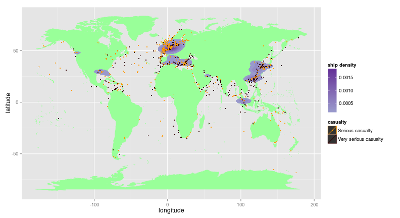
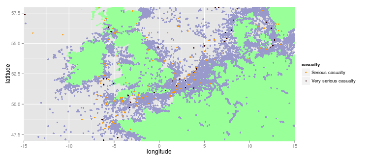
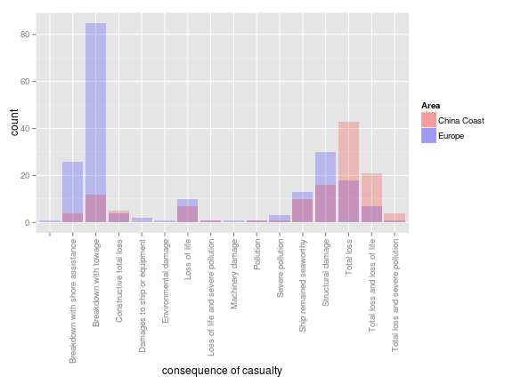
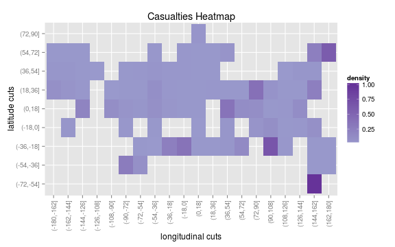
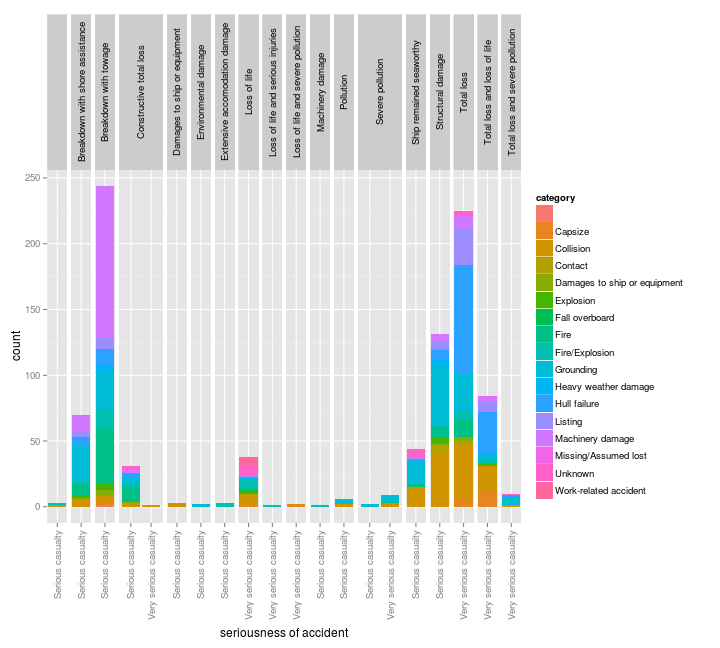

**Ship Casualties Exploratory Analysis**
========================================================


Introduction
-----------

  As of today, 90% of goods are still transported by ships. It is very cheap, and more environmentally friendly than using trucks where it is possible. However, it does not have the public scrutiny other industries have, such as Asian manufactures, even though I would bring them closer. Some people cheaply make goods when others cheaply transport it. [see this 10 min video](http://www.ted.com/talks/rose_george_inside_the_secret_shipping_industry#).   
The ecosystem around the maritime transportation is very old and secretive. And it still works in a very old-fashioned way, sprinkled with finance capitalism (economical dumping happened here quite some time ago, maybe facilitated by the fact that the shipping industry is by essence global).

  In this industry, open data is a very (very) bad word, returns of experience are not enforced as bearers of bad news are easily blamed. One could sum it up as “Good data is no data”.
However there exists very extensive datasets as the industry needs them. Those data are available at a steep cost.

  In a previous life, I was working as a marine engineer, studying ships accidents to develop better rules. Having a very restricted access to data was a frustration to say the least. In this analysis I want to find publicly available data, and use it to extract any information that would help understand ships accidents.
  

1- Presentation of the shipping industry
-----------------------------------------

###  A little bit of history

  Using ships to transport goods and people is not a recent enterprise. Quite the opposite actually, and this industry started to organize itself a long time ago. It all started when the underwriters who insured ships and cargo, and the merchants who chartered the ships, wanted to get a better return on investment. They decided to give a grade to, or more exactly classify the ships according to their hull qualities and condition.     
Better informed, underwriters and merchants thought they could make better decisions.
Private companies were created to classify the ships, they were called classification society. This took place in the 18^th century, and still represents how things work today.
[more info](http://en.wikipedia.org/wiki/Classification_society)

  We can see here how databases started to get built by Classification societies to register the ships characteristics and their evolution. An other database was also created to keep track of the ships whereabouts, and all kinds of things underwriters and merchants were interested in but not tackled by the former.
[more info](http://en.wikipedia.org/wiki/Lloyd%27s_List)

###  A ship now

  As classification rules evolved, they now encompass the whole life of the ship. From the design to regular inspections, Classification societies are in charge of checking if ships follow their standards. However, they are not official bodies, so they cannot be held reponsible in case an accident happen.
A ship owner does not need to class his/her ship, however, it may be a poor business choice as insurance companies use this classification to evaluate premiums.

  A ship must be registered by a country to sail, just as a driver registers his car at the DMV. Countries are called flag state, and they can impose rules to register a ship. For example since the Titanic accident, a worldwide rule was created to ensure the Safety Of Life At Sea (SOLAS). Usually, countries license the controle of these rules to the expert in that field: the (country based) Classification society.
However, contrary to the car owner, a ship owner can now choose where he/she wants to register his ship and he can choose whichever Classification society he wants if he wants to classify his/her ship. This can be a good source of revenue for a country.
  
  A ship can also be inspected when arriving at a port (this is called port state control), this can also be delegated to a Classification society, or left to a special body of State workers. The port instances bill the time spent at berth to the ship owners, and rules can be such as some ships are welcome in some countries but not in others. This is a source of competition among ports, particularly in Europe where countries are small and needs high.


2- My data
-----------

I devised two datasets:

 - one of ships positions.   
 I wish to be able to match ships accidents locations against ships locations. It comes from http://www.sailwx.info/shiptrack/search.phtml. This website tracks the ships position of all ships who are part of a project to gather weather observations all around the world. Those ships may are not necessarily large cargo ships.
  Difficulties arised as how to use the search form: If you give a ship name, you are redirected to a new page where you can collect the data. It would be relatively easy to loop through all the ships name if only I could have access to such a list. Another way is to fill the form with only one character such as "a", and as a result we get all ships which name contains an "a". However the search time on the website is very long, if successfull at all. In the end I could only collect the data for a few letters. It was saved in a txt format on my computer and let around 180000 positions, which hopefully are representative of all ships positions around the world. This data was collected in a couple of hours on the same day.

 - one of ships casualties.   
 It comes from the [International Maritime Organisation](https://webaccounts.imo.org/Common/WebLogin.aspx?ReturnUrl=%2fDefault.aspx), a branch of the UN in charge of the maritime industries. It was downloaded as a set of pdf documents and then parsed, the data are from 1998 to 2003 only, and I only kept the subset where the accidents latitude and longitude were reported.


3- Analysis
------------
### *1. Data Cleaning*

The script is provided in annex.


#### For the ships positions

The data was already in a tabular format.
Cleaning consisted in eliminating duplicates and formatting the latitude and longitude columns.
Each row is one ship position.

#### For the ships accidents

The pdf and layout of the data made it impossible to read in R, so the table formatting step was done in python (sample script in annex). The data was then saved as csv and read into R where it was further cleaned, which implied setting the dates right, formatting the latitude and longitude and using lots of regular expressions functions.
Each row gives information about 1 accident.

I have the following features

name                   |     definition
-----------------------|----------------
dataSource    | who gave the information about the accident
flagState    | ship flag's State
date    | date of the accident
casLife    | factor with 2 levels indicating if there are injuries/fatalities (very serious casualty) or not (serious casualty)
lat    | latitude
long    | longitude
fatalities    | number of fatalities if any (no data for 2002, hence NA's were introduced)
injuries    | number of injuries if any (no data for 2002, hence NA's were introduced)
consequence    | a consequence of the accident
shipType   | type of ship
DOB   | year of the ship's construction
category   | category of the accident (defined by the IMO)


### *2.  Geographical Analysis*

It tries to answers the questions: Where are most ships ? Where do accidents happen ? And what kind of consequences do they have ?

  Let's make a global map

 


Looking the ship positions, the latitude range (-88.0833, 89.4833) and longitude range (-197.15, 179.7) cover the whole world, but ships are concentrated mainly in Europe, and then, around Singapore and along the coast of China. This matches the fact that the busiest sea ports are in Singapore, Shangai, Hong-Kong, Rotterdam and Dover ([wikipedia](http://en.wikipedia.org/wiki/World%27s_busiest_port)).
Why does North-East Europe look more densely populated by ships? 
I would say that there is more coastline, and hence more secondary ports and less open water, and let's not forget my ships positions concern all kinds of ships. Maybe Europeans sail more , or to the least voluntarily give there position more willingly than Asian people. This could be backed by the fact that piracy is still pregnant in Asia, but eradicated in NorthEastern Europe.

  If we make a detailed map for Europe
 


Some casualties appear inland: as my data set only registers large ships accidents, I can assume some casualties may lack precision in their position assessment, or in the projection of the data on the plot.
We can see a very large cloud of ships on the coast and estuaries, and even rivers along Belgium and the Netherlands, where the busiests ports are. 
We can also spot a line on the Dover Strait, I guess this is the Ouessant Traffic Separation Scheme. Ship traffic is so dense in this area, it was decided to create some kind of ship boulevard along the Dover strait, with crossing rules to make this area safer. We can still spot numerous casualties there.


  We can compare casualties in Europe and along the Coast of China:   
In Europe there are 204 accidents.    
In the China Sea, there are  125 accidents.

The casualties do not differ by the ships age (31 for Europe versus 32).   
They actually differ by the consequences of the accident
 

As we can see, shore assistance and towage are much more important in Europe. Maybe the coast is closer, or assistance is better organized in Europe.
Hence, accidents are more dramatic in the China Sea as all accidents concluding to Total losses are in a larger number. 


  Now let's try make a global heatmap of ship casualty positions.  
I created 10 buckets for the latitude and 20 for the longitude. In each bucket where data was non null, I divided the number of casualties by the total number of ships.
 

Areas that stand out are:
the East coast of Australia (one ship was spotted and an Australian research vessel had a fire).
Then: the South East Indian Ocean (3 ships spotted, 2 accidents), Kamtchatka (5 ships spotted, 3 accidents), South Atlantic Ocean(10 ships spotted, 4 accidents), Africa East coast(49 ships spotted, 18 accidents).


If I consider the African East coast, where I have enough events, looking at the consequences of an accident, I have : 1, 3, 1, 2, 9, 2
This area seems clearly inhospitable.

### _3. Casualty Factors_

I will look at the factors in my casualties data set. Trying to answer : are some flag States more negligent ? Is there a season for accidents (winter storms in the Northern Hemisphere) ?
Are some type of ships more accident prone ? Does age play a role ?
Do some accidents have worse consequences than others ?   

  __1-  Seriousness of casualty__

In my data, I have 910 accidents. They are divided in 2 categories:
  - serious casualty,
  - very serious casualty: the accident includes injuries and/or fatalities.

It is decomposed as is:

```
##             seriousness count percentage
## 1      Serious casualty   540      59.34
## 2 Very serious casualty   370      40.66
```


  __2-  Flag State__

In my set, there are 84 different flag States.
The flag States with most casualties are :   

```
##                                  casualtyPercentage
## PANAMA                                        13.96
## ANTIGUA AND BARBUDA                            6.15
## BAHAMAS                                        4.84
## SAINT VINCENT AND THE GRENADINES               4.84
## CYPRUS                                         4.73
## LIBERIA                                        4.73
## MALTA                                          4.51
## UNITED KINGDOM                                 3.85
## NORWAY                                         2.53
## BELIZE                                         2.31
```

It would be interesting to match it with the data for the world merchant fleet.  

The CIA World Fact Book contains that data for 2010, let's compare.   


The number of countries represented in this set is 156.
The major countries are: 

```
##              flagState fleetPercentage
## 1               PANAMA           16.45
## 2              LIBERIA            7.11
## 3                CHINA            5.21
## 4                MALTA            4.23
## 5            HONG KONG            4.22
## 6            SINGAPORE            4.10
## 7     MARSHALL ISLANDS            4.09
## 8            INDONESIA            3.44
## 9  ANTIGUA AND BARBUDA            3.22
## 10        BAHAMAS, THE            2.98
```

Panama first position in the casualty set is put into perspective since this country is also the first flag State by the number of ships it registers. The data I have do no allow me to draw any better conclusion.

  __3-  Date__

This is what I could obtain by year:

```
## Source: local data frame [6 x 2]
## 
##   year  nb
## 1 1998 128
## 2 1999 177
## 3 2000 228
## 4 2001 159
## 5 2002 168
## 6 2003  50
```

From the pdf document, it appears 2003 has been a better year than the ones before, but most of all, more reports excluded the accident position.
No pattern regarding the seasons could be seen.

  __4-  Fatalities and Injuries__

Let's see the decomposition of fatalities and injuries by year:

```
## Source: local data frame [6 x 3]
## 
##   year nbFatlities nbInjured
## 1 1998         196        15
## 2 1999         105        40
## 3 2000         122        34
## 4 2001           0         0
## 5 2002        1139        15
## 6 2003          43         3
```

Data is missing for 2001

I have a huge number of fatalities in 2002, let's count the number of accidents involving fatalities

```
## Source: local data frame [5 x 3]
## 
##   year nbAccidents nbFatlities
## 1 1998          28         196
## 2 1999          20         105
## 3 2000          29         122
## 4 2002          13        1139
## 5 2003           8          43
```

In 2002, one accident was the major cause of death:

```
##     flagState       date               casLife   lat  long fatalities
## 824   SENEGAL 2002-09-26 Very serious casualty 13.22 -17.1       1100
##     injuries                 consequence shipType  DOB category
## 824        0 Total loss and loss of life    FERRY 1990  Listing
```

Passenger ships do not have that many very serious accidents, but when they do they are way more dramatic in terms of loss of life. More info about this terrible casualty [here](http://en.wikipedia.org/wiki/MV_Le_Joola).   
Since 2002, I remember the [Costa Concordia](http://en.wikipedia.org/wiki/Costa_Concordia_disaster) in Italy and [MV Sewol](http://en.wikipedia.org/wiki/Sinking_of_the_MV_Sewol) in Korea. The common point in these 3 cases is that ships started listing heavily. This can make evacuation very tricky, since walking becomes very hard and some lifeboats become unavailable.

  __5- Ship Type__

Let's first see what type of ships are most accident prone:

```
##                         casualtyPercentage
## GENERAL CARGO SHIP                   45.71
## BULK CARRIER                         13.63
## OIL TANKER                            7.58
## RO-RO CARGO SHIP                      4.73
## CONTAINER SHIP                        4.62
## CHEMICAL TANKER                       2.64
## REFRIGERATED CARGO SHIP               2.53
## TUG                                   2.20
## PASSENGER SHIP                        1.87
## FERRY                                 1.76
```

Like with the flag states, let's match it with the world fleet data. This time I could find data from 2005 in a report from Equasis, which is a branch of the European Maritime Safety Agency.

```
##                    ShipType percentage
## 1      General Cargo Ships       25.92
## 12                    Tugs       16.43
## 6  Oil and Chemical Tankers      14.91
## 5             Bulk Carriers      10.32
## 9          Passenger Ships        9.43
## 11           Service Ships        6.08
## 10        Offshore Vessels        6.03
## 3          Container Ships        4.89
## 4         Ro-Ro Cargo Ships       2.26
## 7              Gas Tankers        1.76
```


As a conclusion, we can see that general cargo ships, tugs, and ro-ro cargo ships are overepresented in the casualty data set with regards to their percentage in the whole fleet. 

We can try to see some unique caracteristics to the accidents involving those ships.   
For general cargo ships,  the accidents and their consequences are mostly:

```
## Source: local data frame [5 x 2]
## 
##           category count
## 1     Hull failure    99
## 2 Machinery damage    74
## 3        Grounding    70
## 4        Collision    50
## 5          Listing    42
```

```
## Source: local data frame [5 x 2]
## 
##                       consequence count
## 1                      Total loss   138
## 2           Breakdown with towage   116
## 3     Total loss and loss of life    49
## 4               Structural damage    47
## 5 Breakdown with shore assistance    29
```

```
## Source: local data frame [2 x 2]
## 
##                 casLife count
## 1      Serious casualty   217
## 2 Very serious casualty   199
```

There are so many general cargo carriers in my set, it is interesting to see what it would look like without that type of ships.

```
## Source: local data frame [5 x 2]
## 
##           category count
## 1        Grounding   106
## 2        Collision    98
## 3 Machinery damage    74
## 4             Fire    60
## 5     Hull failure    50
```

```
## Source: local data frame [5 x 2]
## 
##                       consequence count
## 1           Breakdown with towage   128
## 2                      Total loss    87
## 3               Structural damage    84
## 4 Breakdown with shore assistance    41
## 5         Ship remained seaworthy    36
```

```
## Source: local data frame [2 x 2]
## 
##                 casLife count
## 1      Serious casualty   323
## 2 Very serious casualty   171
```

The main categories of accidents for general cargo ships are different from the other ships. The top 2 categories for general cargo ships: hull failure and machinery damage invoke some ship deficiencies. It seems like those ships are in poor condition, poorly maintained, or poorly built in the first place. On the other hand, for the other ships, we have grounding and collision, which implies some issues with the skills of the crew. However, consequences are similar.
Casualties involving general cargo ships are more dangerous for people (crews mainly) than the other casualties


For tugs, the accidents and their consequences are:

```
## Source: local data frame [3 x 2]
## 
##       category count
## 1         Fire     6
## 2    Collision     5
## 3 Hull failure     3
```

```
## Source: local data frame [3 x 2]
## 
##                   consequence count
## 1                  Total loss     9
## 2 Total loss and loss of life     4
## 3       Breakdown with towage     3
```

```
## Source: local data frame [2 x 2]
## 
##                 casLife count
## 1      Serious casualty     6
## 2 Very serious casualty    14
```

Collisions are more important here, but it can be explained by the role of tugs. Casualties involve fatalities or injuries in 30% of cases. This is way more than average. Seafearers on board tugs have a dangerous job.

For ro-ro cargo ships,  the accidents and their consequences are mostly:

```
## Source: local data frame [3 x 2]
## 
##           category count
## 1             Fire    11
## 2 Machinery damage     7
## 3        Collision     6
```

```
## Source: local data frame [3 x 2]
## 
##             consequence count
## 1     Structural damage    13
## 2 Breakdown with towage    10
## 3            Total loss     6
```

```
## Source: local data frame [2 x 2]
## 
##                 casLife count
## 1      Serious casualty    32
## 2 Very serious casualty    11
```

Here fire plays an important role, and most accidents do not involve people's lives.

  __6- Ship age__

If we make a summary of the data, we have:

```
##    Min. 1st Qu.  Median    Mean 3rd Qu.    Max.    NA's 
##    1920    1970    1980    1980    1990    2000      21
```

The ships in the casualties data set are in average 35 years old. The world merchant fleet may be younger by 10 or so years (I did not see actual data backing this).
Older ships seem more prone to accidents, however, if I look at the older ships in my data set (the first quartile),  they are not involved in significantly different or more serious accidents than other ships.

Looking at ships registered in Panama, or general cargo ships... I could not see any accidents involving significantly older or younger ships than average.

  __7- Accident category and consequences__
  
These 2 are grouped together, as if we evaluate their chi^2, we have:
1141.8712 with a p-value of 7.4493 &times; 10<sup>-107</sup>. So we can assume there is some link between them.

I am looking at the link between those 2 factors and throwing in the seriousness of the casualty.



From this plot:
It looks like there is no obvious relation between the category of an accident and the consequence. Accidents can have multiple outcomes.
If I consider the seriousness of the casualty and the accidents consequences, I can see that only 2 outcomes lead to both serious and very serious casualties, all other outcomes fall in one or the other category but not both. ( the chi^2 is 899.2027, p-value 3.1399 &times; 10<sup>-180</sup>).      
It looks like only some consequences lead to injuries or fatalities, it is to no surprise when the consequences actually mention a loss of life, but for other cases it raises more questions.
Why differentiate total loss from total loss and loss of life ? Is it only to distinguish fatalities from injuries ? Is there too much leeway in assessing the outcome of an accident ?
No accidents with shore assistance or towage involve any injuries or fatalities. Even though I have confidence costal states having coast guards or similar do an amazing job, I am a bit surprised they always arrive before anyone on board is injured, for any category of accident.


4- Conclusion
---------------
  For this analysis, I used two data sets, one was a simple and long list of ship positions on the globe, the other was a set of 910 accidents that had happened between 1998 and 2003.
There are websites dedicated to mapping ship positions all over the world, since all ships are required to give their GPS position. However, the actual data is not available, at least not freely, ship-owners arguing it would help piracy. This all seems pretty hypocrite, but it is the current standpoint.   
As for ships accidents, there exists two global data sets that people use when they want to compile the data and write some report: the LLoyd's List and the Lloyd's Register ( example of the last from [Allianz](http://www.agcs.allianz.com/assets/PDFs/Reports/Shipping-Review-2014.pdf)). These two databases are independant and compiled by different companies, despite their name. The Lloyd's Register is the oldest Classification society and the Lloyd's List the other extra data set I mentionned earlier. Their access is very expensive. I used the public data given by the IMO, as an International body, one could expect to have something similar to the World Bank ? But clearly it is not the case. I found data from 1998 to 2003 only, in pdf formats. For later years, each year, the IMO has compiled a selection of accidents they had decided to investigate, these accidents could encompass several years and they were also presented in a pdf format. I did not use this extra source, firstly because I hadn't found them (the titles of these compilations are not explicit, and they were not tagged properly), and then because I am way too short on time to clean and merge this data.

What I found in my data set was:
- it does not seem that there are more accidents in high density areas (in terms of number of ships) than in the middle of nowhere on a relative scale. Even though collisions or even grounding are two accident categories which are not present in open water and less dense areas.
- the China Sea and Europe are the areas with most ship traffic and accidents. However, accidents happening in the China Sea have more dire outcomes than accidents happening in Europe.
- flag States do not have an influence on ship accidents. This is contrary to the common belief, when we talk of the largest flag States as open registers or flags of convenience. However those countries ar also the ones that contribute to the IMO [the most](http://www.imo.org/About/Pages/Structure.aspx).
- general Cargo Ships make the bulk of accidents, followed by tugs. It looks like tugs have a dangerous role to play in the shipping industry.
- and, what surprised me most, an almost perfect match between the accidents consequences and seriousness of it. Maybe it has been built this way, but still, I believed things were more open than they are, particularly as some consequences are very vague. I also though I could have spotted a more direct correspondence between the casualties categories and the consequences. 


Despite my limitations, I still could learn from what I had, and clear some misconceptions I had. I wish there were more, and more accessible. There is an ongoing discussion at the IMO to improve their ships casualty database. But it is still discussion, and the question remains: who will have access ?
